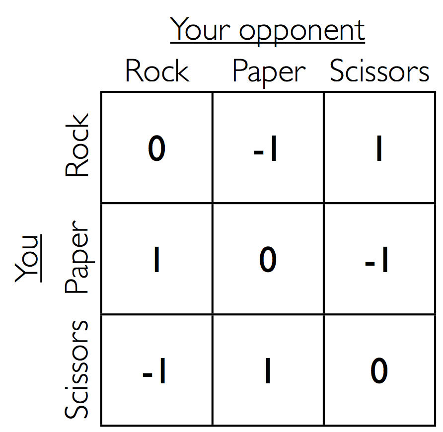

<!--
# Links
 * Tutorial : http://pages.stat.wisc.edu/~yandell/statgen/ucla/Help/Producing%20slide%20shows%20with%20Pandoc.html
 * beamer full documentation: http://ctan.math.utah.edu/ctan/tex-archive/macros/latex/contrib/beamer/doc/beameruserguide.pdf
    - Full documentation is not required since we want pandoc to do most of the heavy lifting
    - Yet, it may be required to go through sections:
    - 13: Graphics
    - 14: Animations
    - 15: Themese, let's stick with warsaw, but read if interested

        create pdf with pandoc -t beamer gan-presentation.md -V theme:Warsaw -o gan-presentation.pdf
# Samples
 * image:
        
 * scaled image:
        \centerline{\includegraphics[width=0.75\textwidth]{imgs/gan-eqn3.png}}

-->

# Introduction
## What are Generative models?
 * have a data set of training examples x_i ~ p_data(x)
 * want to be able to generate new examples x_hat ~ p_model(x)
 * want that p_model is aproximatel p_data

## Why Generative models
 * task requirements
 * unsupervised learning
 * clean up noisy or missing data
 * reinforcement learning

## Game theory
 * zero sum game with mixed strategy equilibrium
 
 * Minimax: nash equilibrium at saddle point
 

## Adversarial networks
 * Game between two players
    -mixed strategy equilibrium when one learns to generate data

 * Generator:
    -tries to create fake samples that look like the real thing

 * Descriminator:
    -tries to tell which are fake and which are real

# Methods
## Definitions
 * Z some data space
 * X an object (generated or real)
 * Generator G: Z -> X 
 * Descriminator D: X -> {0,1}

## Equations

### Discriminator loss
D tries to identify fakes

### Generator loss
## Algorithms
* \url{https://www.youtube.com/watch?v=CILzNj2MP3s}

# Theorertical Results

##  Optimal value for the objective function
* For a fixed $G$ aim of discriminator $D$ is to maximize $V(G,D)$

\

* using $argmax (a log(y) + b log(1-y)) = \frac{a}{a+b}$, we get

* Now the aim of $G$ is to minimize $C(G)$

----

* ...

* We can write this equation in terms of KL divergence between normalized distributions

* Which can also be written as the Jensen-Shannon divergence between the
model's distribution and the data generating process

* Thus, $C^{*} = -\text{log}(4)$ is the optimum value attained when
\centerline{$p_g = g_{\text{data}}$}

## Convergence of training algorithm

## Experimental

{}

# Conclusions

## Advantages

This model provides many advantages on deep graphical models and their alternates:

* inference becomes simple by avoiding Markov chains
* Training becomes requires only backprop of gradients
* Any differentiable function is theoretically permissible

## Disadvantages

Most important challenges include:

* Synchronizing the discriminator with generator
    - If $G$ trains faster than $D$, it may collapse too many $z$ to the same value of $x$

* there is no explicit representation of $p_g(x)$
    - approximated with Parzen density estimation
    
    - Comes quite close to Gaussian for large number of samples;
    Plots for sample size = 1, 10, 100, 1000
    \footnote{\url{https://www.cs.utah.edu/~suyash/Dissertation_html/node11.html}}

\centerline{
\includegraphics[width=0.2\textwidth]{imgs/parzen-graph-a.png}
\includegraphics[width=0.2\textwidth]{imgs/parzen-graph-b.png}
\includegraphics[width=0.2\textwidth]{imgs/parzen-graph-c.png}
\includegraphics[width=0.2\textwidth]{imgs/parzen-graph-d.png}
}

----

* Mean of gaussian example 
    - \url{https://www.youtube.com/watch?v=mObnwR-u8pc}
    - \url{https://www.youtube.com/watch?v=0r3g7-4bMYU}

## Interesting experiments
* Interpolation between hand written number 1 to 5

----

* Adding Glasses\footnote{Radford, A., Metz, L., Chintala, S.: Unsupervised representation learning with deep convolutional generative adversarial networks. In: ICLR (2016)}

----

* Faces turn\footnote{Radford, A., Metz, L., Chintala, S.: Unsupervised representation learning with deep convolutional generative adversarial networks. In: ICLR (2016)}

