# Introduction

## What are Generative models?
### The aim
* have a data set of training examples $x_{i} \sim p_{data}(x)$
* want to be able to generate new examples $\hat{x} \sim p_{g}(x)$
* want that $p_{g} \approx  p_{data}$

### Example models
* Hidden Markov models
* Graphical models (directed/undirected)
* Restricted Boltzmann Machines
* Generative autoencoders

## Why Generative models
* useful or required for many tasks
    - generating realistic audio from text (text to speach)
    - machine translation 
* clean up noisy or missing data
\centerline{\includegraphics[width=0.60\textwidth]{imgs/inpainting.png}}
* unsupervised learning
    - can be used to learn features from raw data
    - "What I cannot create I do not understand" Richard Feynman

## Game theory
 * zero sum game with mixed strategy equilibrium
 * Minimax: nash equilibrium at saddle point
\centerline{
\includegraphics[width=0.4\textwidth]{imgs/rpc.png}
\includegraphics[width=0.5\textwidth]{imgs/Saddle.png}
}

## Adversarial networks
* Game between two players, mixed strategy equilibrium when one learns to generate data
* Generator tries to create fake samples that appear real
* Descriminator tries to tell which are fake and which are real

\centerline{
\includegraphics[width=0.3\textwidth]{imgs/descriminator.png}
\includegraphics[width=0.3\textwidth]{imgs/generator.png}
}

# Methods
## Definitions
* Z some latent space
* X a data point (generated or real)
* Generator $G(z): Z \to X$
* Descriminator $D(x): X \to \{0,1\}$
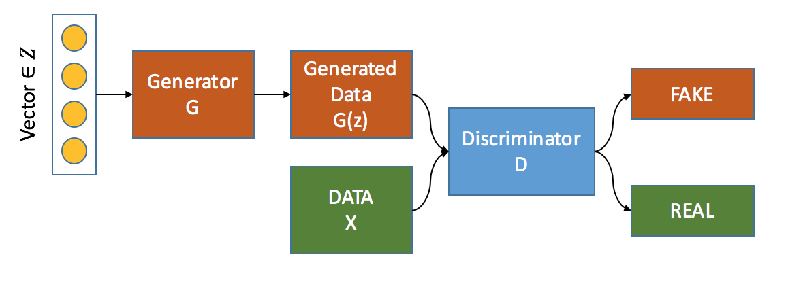

## Loss functions
* Minimax
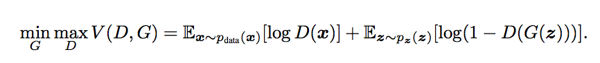
* Discriminator
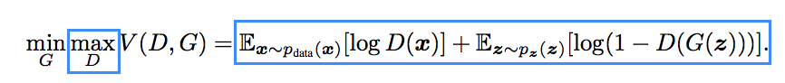
* Generator
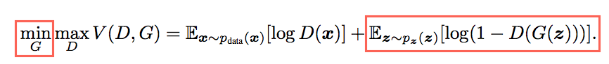
* in practice learning for G may be bad with equation above so maximize $\log(D(G(z)))$

## Algorithms
* the algorithm
\includegraphics[width=0.8\textwidth]{imgs/algorithm.png}
* \url{https://www.youtube.com/watch?v=CILzNj2MP3s}

# Results

##  Optimal value for the objective function
* For a fixed $G$ aim of discriminator $D$ is to maximize $V(G,D)$
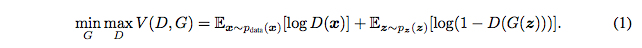
\

* using $argmax (a \cdot log(y) + b \cdot log(1-y)) = \frac{a}{a+b}$, we get
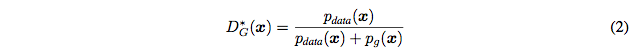
* Now the aim of $G$ is to minimize $C(G)$
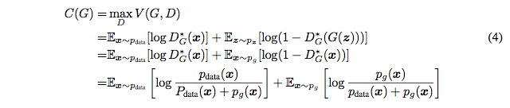

----

* ...

* We can write this equation in terms of KL divergence between normalized distributions
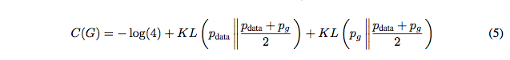
* Which can also be written as the Jensen-Shannon divergence between the
model's distribution and the data generating process
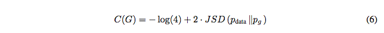
* Thus, $C^{*} = -\text{log}(4)$ is the optimum value attained when
\centerline{$p_g = p_{\text{data}}$}

## Convergence of training algorithm

* Proof
    - Sub derivatives at optimal lie in sub derivatives of the overall function
    - So the training algorithm is equivalent to computing gradient descent at optimal
    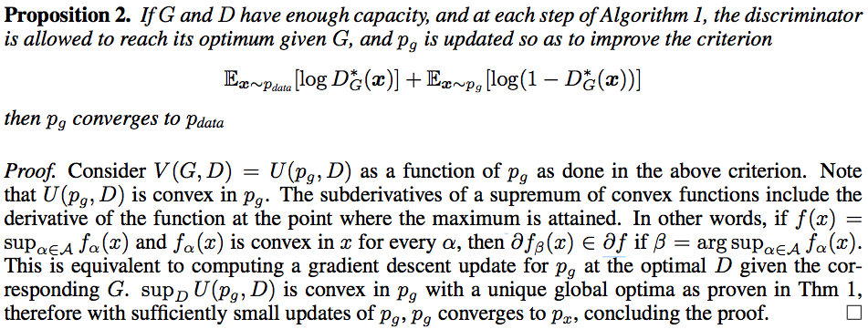

----

* Not sure if...

----

* Intuition\
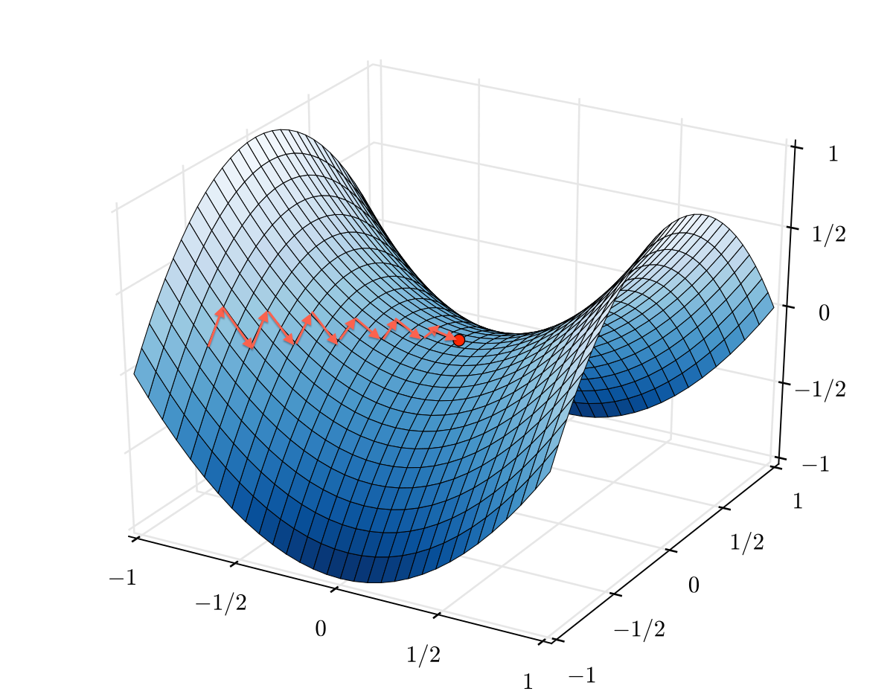

----

## Experimental
* Log likelyhoods for MNIST and TFD
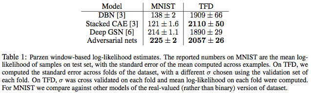
* a synthetic measure, based on Parzen window estimates of $P_{data}$
* need for robust measure for generative models in general

# Conclusions

## Advantages

* This model provides many advantages on deep graphical models and their alternatives
* Training becomes requires only backprop of gradients
* Any differentiable function is theoretically permissible

## Disadvantages

Most important challenges include:

* Synchronizing the discriminator with generator
    - If $G$ trains faster than $D$, it may collapse too many $z$ to the same value of $x$
    - \url{https://youtu.be/mObnwR-u8pc?t=18s}
    - Can be dealt with by feeding the Discriminator with a batch of generated data
    - \url{https://youtu.be/0r3g7-4bMYU?t=6s}

----

* there is no explicit representation of $p_g(x)$
    - approximated with Parzen density estimation
    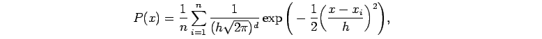
    - Comes quite close to Gaussian for large number of samples;
    Plots for sample size = 1, 10, 100, 1000
    \footnote{\url{https://www.cs.utah.edu/~suyash/Dissertation_html/node11.html}}

\centerline{
\includegraphics[width=0.2\textwidth]{imgs/parzen-graph-a.png}
\includegraphics[width=0.2\textwidth]{imgs/parzen-graph-b.png}
\includegraphics[width=0.2\textwidth]{imgs/parzen-graph-c.png}
\includegraphics[width=0.2\textwidth]{imgs/parzen-graph-d.png}
}

## Interesting experiments
* Interpolation between hand written number 1 to 5
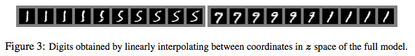

----

* Adding Glasses\footnote{Radford, A., Metz, L., Chintala, S.: Unsupervised representation learning with deep convolutional generative adversarial networks. In: ICLR (2016)}
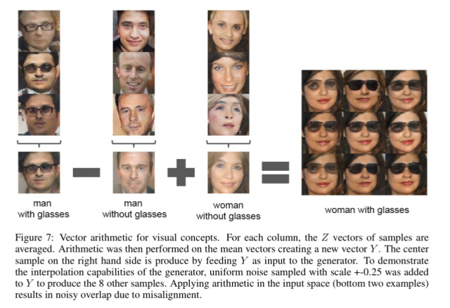

----

* Faces turn\footnote{Radford, A., Metz, L., Chintala, S.: Unsupervised representation learning with deep convolutional generative adversarial networks. In: ICLR (2016)}
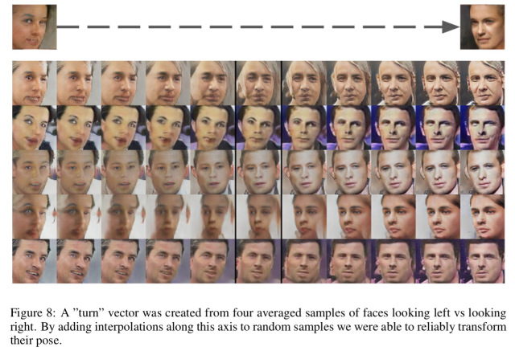

----

### Thank You
