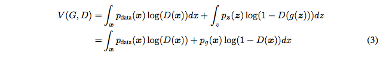

<!--
# Links
 * Tutorial : http://pages.stat.wisc.edu/~yandell/statgen/ucla/Help/Producing%20slide%20shows%20with%20Pandoc.html
 * beamer full documentation: http://ctan.math.utah.edu/ctan/tex-archive/macros/latex/contrib/beamer/doc/beameruserguide.pdf
	- Full documentation is not required since we want pandoc to do most of the heavy lifting
	- Yet, it may be required to go through sections:
	- 13: Graphics
	- 14: Animations
	- 15: Themese, let's stick with warsaw, but read if interested

# Samples
 * image:
		
 * scaled image:
		\centerline{\includegraphics[width=0.75\textwidth]{imgs/gan-eqn3.png}}

-->

<!-- # Methods
## Equations
### Discriminator loss
### Generator loss
## Algorithms
 * https://www.youtube.com/watch?v=CILzNj2MP3s
 -->

# Results

##  Optimal value for the objective function
* For a fixed $G$ aim of discriminator $D$ is to maximize $V(G,D)$

\

* using $argmax (a log(y) + b log(1-y)) = \frac{a}{a+b}$, we get

* Now the aim of $G$ is to minimize $C(G)$

----

* ...

* We can write this equation in terms of KL divergence between normalized distributions

* Which can also be written as the Jensen-Shannon divergence between the
model's distribution and the data generating process

* Thus, $C^{*} = -\text{log}(4)$ is the optimum value attained when
\centerline{$p_g = g_{\text{data}}$}

## Convergence of training algorithm

## Experimental
### Mnist
### cfar

# Conclusions
## Advantages
## Disadvantages
### Overfitting to values of the parameters of the distributions
 * Mean of gaussian example https://www.youtube.com/watch?v=mObnwR-u8pc
 * https://www.youtube.com/watch?v=0r3g7-4bMYU

## Interesting experiments
 * Numbers 1 to 5 as shown in paper
 * Faces turn
 * Man with Glasses - Man without glasses + woman = Woman with Glasses

# Further research (may not include)
## Conditional of some input label
## Pretrained gan weights used to improve supervised classification tasks with small datasets
